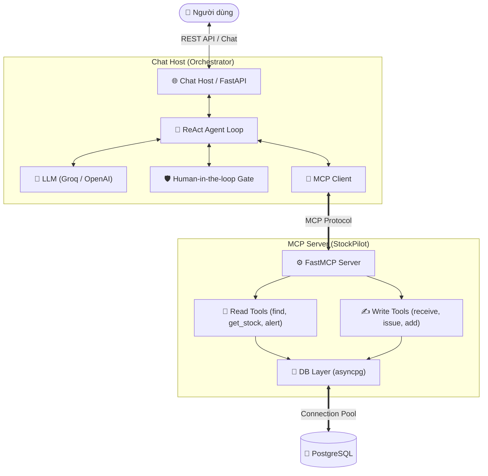

# 📦 StockPilot — AI-Powered Inventory Assistant with MCP

<p align="center">
  
  
  
  
  
  
</p>

<p align="center">
  <b>Trợ lý Quản lý Kho thông minh ứng dụng Model Context Protocol (MCP) & ReAct AI Agent với cơ chế Human-in-the-loop.</b>
</p>

---

## 🎯 Mục đích dự án

**StockPilot** là dự án cá nhân thực hành và đào sâu chuẩn giao thức **Model Context Protocol (MCP)** của Anthropic thông qua bài toán thực tế: **Quản lý kho hàng thông minh (Inventory Management)**.

### 🔑 Điểm nhấn kỹ thuật:
- **Chuẩn MCP:** Tách biệt rõ ràng giữa **Chat Host**, **Client**, và **FastMCP Server**.
- **Human-in-the-loop (HITL):** Tự động phát hiện và yêu cầu người dùng xác nhận (`PENDING` $\rightarrow$ `CONFIRMED`) trước khi thực thi các thao tác nhạy cảm (nhập, xuất kho, tạo sản phẩm).
- **ACID & Idempotency:** Thao tác Database an toàn qua `asyncpg` connection pool và chống trùng lặp giao dịch.
- **Docker Compose:** Khởi chạy đồng bộ FastAPI, PostgreSQL 17 và pgAdmin chỉ với 1 lệnh.

---

## 🏗️ Kiến trúc hệ thống



---

## 🛠️ Danh mục MCP Tools

| Tool | Loại | Tham số chính | Mô tả |
| :--- | :---: | :--- | :--- |
| `find_products` | 📖 Read | `name_or_sku` | Tìm kiếm sản phẩm theo tên hoặc SKU (mờ `ILIKE`). |
| `get_stock` | 📖 Read | `product_id` | Lấy chi tiết tồn kho theo ID sản phẩm. |
| `get_low_stock_products` | 📖 Read | `limit=10` | Cảnh báo danh sách sản phẩm sắp hết hàng. |
| `get_transactions_limit` | 📖 Read | `limit=10` | Lấy lịch sử biến động kho gần nhất. |
| `add_product` | ✍️ Write | `sku, name, unit, ...` | ⚠️ Thêm mặt hàng mới vào danh mục (*cần xác nhận*). |
| `receive_stock` | ✍️ Write | `product_id, quantity, partner` | ⚠️ Nhập kho và lưu log giao dịch (*cần xác nhận*). |
| `issue_stock` | ✍️ Write | `product_id, quantity, partner` | ⚠️ Xuất kho sau khi kiểm tra số lượng tồn (*cần xác nhận*). |

---

## 📁 Cấu trúc thư mục

```text
stockpilot/
├── 📄 compose.yaml             # Docker Compose cho PostgreSQL & pgAdmin
├── 📄 Dockerfile               # Dockerfile cho Chat Host
├── 📄 requirements.txt         # Dependencies
├── 📄 .env.example             # Mẫu cấu hình biến môi trường
├── 📁 db/init.sql              # Schema Database & Index
├── 📁 scripts/seed_products.py # Nạp dữ liệu mẫu
├── 📁 src/
│   ├── 📁 mcp_server/          # FastMCP Server, Database & Tools
│   └── 📁 chat_host/           # FastAPI Host, ReAct Agent & HITL Confirmation
└── 📁 tests/                   # Test suite (Unit, Integration)
```

---

## 🚦 Hướng dẫn cài đặt & Chạy nhanh

### 1. Chuẩn bị môi trường & Database
```bash
# Clone repo & cấu hình .env
git clone https://github.com/tutran27/stockpilot-mcp.git
cd stockpilot-mcp
cp .env.example .env   # Điền GROQ_API_KEY hoặc OPENAI_API_KEY

# Khởi động PostgreSQL qua Docker
docker compose up -d
```
*(pgAdmin xem DB tại `http://localhost:5050` — `admin@admin.com` / `admin`).*

### 2. Cài đặt thư viện & Nạp dữ liệu mẫu
```bash
python3 -m venv .venv
source .venv/bin/activate  # Windows: .venv\Scripts\activate
pip install -r requirements.txt

# Nạp dữ liệu sản phẩm mẫu vào DB
python scripts/seed_products.py
```

### 3. Khởi chạy Server
```bash
python -m src.chat_host.main
```
*(Swagger UI xem và test API tại: `http://localhost:8000/docs`).*

---

## 🧪 Luồng trải nghiệm Human-in-the-loop

### Bước 1: Gửi yêu cầu nhập hàng qua `POST /api/chat`
```json
{
  "message": "Tôi muốn nhập 10 cái Laptop Dell XPS 13 từ NCC FPT, số HĐ: FPT-1234."
}
```
👉 **Agent phản hồi và sinh mã xác nhận:**
```text
⚠️ Thao tác `receive_stock` cần bạn xác nhận trước khi thực hiện.
Mã hành động: `e70ce90c-575f-4462-81ae-672a29b26fdc`
Chi tiết: {'product_id': '...', 'quantity': 10, 'partner': 'FPT'}
```

### Bước 2: Xác nhận thực thi qua `POST /api/chat/confirm`
```json
{
  "action_id": "e70ce90c-575f-4462-81ae-672a29b26fdc"
}
```
✅ **Thao tác được chuyển trạng thái `CONFIRMED` và ghi nhận thành công vào Database!**

---

## 📄 License
Phân phối dưới giấy phép **MIT License**.
