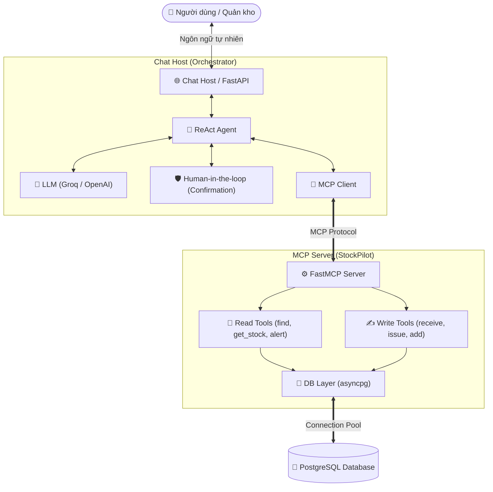

# 📦 StockPilot — AI Inventory Assistant (Dự án Thực hành & Khám phá MCP)

<p align="center">
  
  
  
  
  
  
</p>

---

## 👨‍💻 Về dự án này (About This Project)

Chào bạn! 👋 

**StockPilot** là dự án cá nhân do mình tự tay thiết kế và xây dựng với mục tiêu chính là **nghiên cứu sâu, thực hành và làm chủ giao thức Model Context Protocol (MCP)** mới nhất của Anthropic.

Thay vì chỉ viết các ví dụ "Hello World" đơn giản, mình muốn đặt MCP vào một **bài toán nghiệp vụ thực tế — Trợ lý quản lý kho hàng thông minh**, nơi AI không chỉ trả lời câu hỏi mà còn có thể tác động trực tiếp vào cơ sở dữ liệu thật với đầy đủ các ràng buộc về **bảo mật, tính toàn vẹn dữ liệu (ACID)** và cơ chế **Human-in-the-loop (Xác nhận từ con người)**.

---

## 🎯 Những bài học & kỹ năng mình rèn luyện qua dự án này:

1. **Hiểu sâu chuẩn giao thức MCP (Model Context Protocol):**
   * Tự xây dựng **MCP Server** với FastMCP để phơi bày các công cụ (Tools) có type annotations và schema rõ ràng cho LLM.
   * Xây dựng **MCP Client** để kết nối linh hoạt giữa Chat Host và MCP Server qua Streamable HTTP / In-memory.

2. **Vòng lặp ReAct Agent & Tool Calling:**
   * Điều phối vòng lặp Agent: Nhận câu hỏi tự nhiên $\rightarrow$ Phân tích ý định $\rightarrow$ Chọn tool thích hợp $\rightarrow$ Thực thi $\rightarrow$ Tổng hợp kết quả trả về người dùng.

3. **Cơ chế Human-in-the-loop (Kiểm soát rủi ro AI):**
   * Phân loại công cụ an toàn (**Read Tools**: tìm kiếm, xem tồn kho) và công cụ nhạy cảm (**Write Tools**: nhập/xuất kho, thêm sản phẩm).
   * Khi AI gọi công cụ nhạy cảm: Tự động lưu trạng thái chờ `PENDING` vào Database và yêu cầu người dùng xác nhận (`POST /api/chat/confirm`) trước khi thực sự chạy tool.

4. **Kỹ thuật Backend & Cơ sở dữ liệu chuẩn chỉ:**
   * Sử dụng `asyncpg` với Connection Pool cho hiệu năng cao.
   * Giao dịch nguyên tử (ACID Transactions) để đảm bảo số lượng tồn kho và nhật ký giao dịch (`stock_transactions`) luôn đồng bộ.
   * Chống trùng lặp yêu cầu qua `Idempotency Key`.

5. **Đóng gói & Triển khai với Docker:**
   * Viết `Dockerfile` tối ưu layer caching và `compose.yaml` điều phối tự động cả cụm: FastAPI + PostgreSQL + pgAdmin có healthcheck.

---

## 🏗️ Kiến trúc hệ thống (System Architecture)



---

## 📁 Cấu trúc thư mục (Project Structure)

```text
stockpilot/
├── 📄 compose.yaml             # Docker Compose cho PostgreSQL & pgAdmin
├── 📄 Dockerfile               # Dockerfile cho ứng dụng Python
├── 📄 .dockerignore            # Loại trừ venv, cache, secret khi build Docker
├── 📄 requirements.txt         # Danh sách dependencies
├── 📄 .env.example             # Mẫu cấu hình biến môi trường
├── 📄 README.md                # Tài liệu hướng dẫn dự án
│
├── 📁 db/                      # Cơ sở dữ liệu
│   ├── init.sql                # Khởi tạo bảng, index và constraints
│   └── migrations/             # Migration scripts
│
├── 📁 docs/                    # Tài liệu kỹ thuật & nghiệp vụ
│   ├── architecture.md         # Thiết kế kiến trúc chi tiết
│   └── requirements.md         # Yêu cầu nghiệp vụ
│
├── 📁 scripts/                 # Scripts tiện ích
│   └── seed_products.py        # Nạp dữ liệu sản phẩm mẫu vào DB
│
├── 📁 src/                     # Mã nguồn chính
│   ├── 📁 common/              # Cấu hình & tiện ích chung
│   │   └── config.py
│   │
│   ├── 📁 mcp_server/          # ⚙️ MCP Server cung cấp Tools
│   │   ├── server.py           # Khởi tạo FastMCP Server & Lifespan
│   │   ├── db.py               # Thao tác PostgreSQL (Pool, Read, Write)
│   │   └── 📁 tools/
│   │       ├── read_tools.py   # Các tool tra cứu dữ liệu (Safe)
│   │       └── write_tools.py  # Các tool thay đổi dữ liệu kho (Sensitive)
│   │
│   └── 📁 chat_host/           # 🌐 Chat Host & LLM Agent
│       ├── main.py             # FastAPI Server & API Endpoints
│       ├── agent.py            # Vòng lặp Agent Tool Calling
│       ├── llm.py              # LLM Client Adapter (Groq / OpenAI)
│       ├── confirmation.py     # Quản lý xác nhận Human-in-the-loop
│       └── prompts.py          # System Prompt & Template
│
└── 📁 tests/                   # Kiểm thử tự động (Unit, Integration, E2E)
```

---

## 🛠️ Danh mục MCP Tools đã xây dựng

### 📖 Read Tools (Tra cứu — An toàn, thực thi tự động)
* `find_products(name_or_sku)`: Tìm kiếm sản phẩm theo tên hoặc SKU.
* `get_stock(product_id)`: Xem tồn kho chi tiết của sản phẩm.
* `get_low_stock_products(limit)`: Liệt kê các mặt hàng sắp hết.
* `get_transactions_limit(limit)`: Lấy lịch sử xuất/nhập kho gần nhất.

### ✍️ Write Tools (Thao tác nhạy cảm — Cần Human-in-the-loop)
* `add_product(sku, name, unit, ...)`: Thêm sản phẩm mới vào catalog.
* `receive_stock(product_id, quantity, ...)`: Nhập hàng vào kho và ghi nhận lịch sử.
* `issue_stock(product_id, quantity, ...)`: Xuất hàng khỏi kho (có kiểm tra số lượng tồn).

---

## 🚦 Hướng dẫn chạy thử dự án (Quick Start)

### 1. Chuẩn bị môi trường & Cấu hình
```bash
# 1. Clone repo & copy .env
cp .env.example .env

# Điền GROQ_API_KEY hoặc OPENAI_API_KEY vào .env
```

### 2. Khởi động PostgreSQL qua Docker Compose
```bash
docker compose up -d
```
*(pgAdmin xem DB tại `http://localhost:5050` — `admin@admin.com` / `admin`).*

### 3. Cài đặt Python & Nạp dữ liệu mẫu
```bash
python3 -m venv .venv
source .venv/bin/activate
pip install -r requirements.txt

# Nạp dữ liệu mẫu vào DB
python scripts/seed_products.py
```

### 4. Khởi chạy Chat Host (FastAPI)
```bash
python -m src.chat_host.main
```
*(Swagger UI xem và test API tại: `http://localhost:8000/docs`).*

---

## 🧪 Luồng thử nghiệm Human-in-the-loop thực tế

1. **Gửi tin nhắn muốn nhập kho qua `POST /api/chat`:**
   ```json
   {
     "message": "Tôi muốn nhập 10 cái Laptop Dell XPS 13 từ NCC FPT, số HĐ: FPT-1234."
   }
   ```
   👉 **Agent phản hồi và cấp mã hành động:**
   ```text
   ⚠️ Thao tác `receive_stock` cần bạn xác nhận trước khi thực hiện.
   Mã hành động: `a1b2c3d4-5678-90ab-cdef-1234567890ab`
   Chi tiết: {'product_id': '...', 'quantity': 10, ...}
   ```

2. **Xác nhận thực hiện qua `POST /api/chat/confirm`:**
   ```json
   {
     "action_id": "a1b2c3d4-5678-90ab-cdef-1234567890ab"
   }
   ```
   👉 **Kết quả:** Thao tác được chuyển trạng thái `CONFIRMED` và thực thi thành công vào Database!

---

## 📬 Liên hệ & Đóng góp
Nếu bạn cũng đang tìm hiểu về **MCP (Model Context Protocol)** hoặc **AI Agents**, rất vui được kết nối và trao đổi cùng bạn! 🚀
