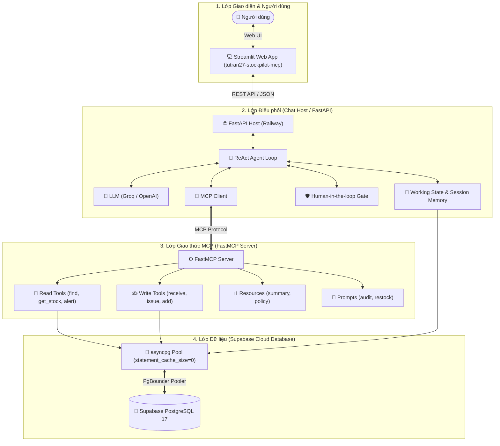

# 📦 StockPilot — AI-Powered Inventory Assistant with Model Context Protocol (MCP)

<p align="center">
  
  
  
  
  
  
  
</p>

<p align="center">
  <b>Trợ lý Quản lý Kho thông minh ứng dụng Model Context Protocol (MCP) & ReAct AI Agent với cơ chế Human-in-the-loop và Bộ nhớ Ngữ cảnh Đa Phiên (Hybrid Working State).</b>
</p>

---

## 🌐 Live Demo & Trải nghiệm Trực tuyến

* 🚀 **Giao diện Web Chat (Streamlit):** [https://tutran27-stockpilot-mcp.streamlit.app/](https://tutran27-stockpilot-mcp.streamlit.app/)
* ⚡ **Backend API & Swagger Docs (Railway):** [https://stockpilot-mcp-production.up.railway.app/docs](https://stockpilot-mcp-production.up.railway.app/docs)
* 🐘 **Database:** Managed PostgreSQL 17 trên **Supabase Cloud** (Transaction Pooler - PgBouncer).

---

## 🎯 Điểm nổi bật & Tính năng cốt lõi

1. **Chuẩn Model Context Protocol (MCP):**
   * **Tools:** Đầy đủ công cụ Đọc (`find_products`, `get_stock`, `get_low_stock_products`) và Ghi (`receive_stock`, `issue_stock`, `add_product`).
   * **Resources:** Tài nguyên dữ liệu động (`stock://summary/realtime`) và tĩnh (`stock://policy/safety`).
   * **Prompts:** Kịch bản mẫu tích hợp sẵn (`/audit` - Kiểm toán cuối ngày, `/restock <NCC>` - Kế hoạch đặt hàng).

2. **Cơ chế Human-in-the-loop (HITL) An toàn:**
   * Tự động phát hiện và chặn các thao tác nhạy cảm (nhập kho, xuất kho, thêm sản phẩm).
   * Tạo mã hành động tạm thời (`PENDING`), sinh nút bấm trực quan trên Web để người dùng duyệt (`CONFIRMED`) hoặc từ chối (`CANCELLED`).

3. **Bộ nhớ Ngữ cảnh Đa Phiên (Hybrid Working State & Multi-Session):**
   * Tự động trích xuất và ghi nhớ thực thể (Mã sản phẩm, Tên NCC, Số Hóa đơn) theo dạng bảng quy tắc ánh xạ (*Declarative Field Mapping*).
   * Hỗ trợ tạo nhiều phiên trò chuyện (**New Conversation**), chuyển đổi linh hoạt giữa các phiên cũ và xem trực quan State theo thời gian thực.

4. **Kiến trúc ACID & Chống Trùng lặp (Idempotency):**
   * Sử dụng `idempotency_key` và cơ chế khóa dòng giao dịch (`transaction`) chống nhập/xuất kho trùng lặp.

---

## 🛠️ Công nghệ sử dụng (Tech Stack)

| Thành phần | Công nghệ / Thư viện | Vai trò |
| :--- | :--- | :--- |
| **Giao thức MCP** | `mcp` (Anthropic Python SDK) | Tách biệt chuẩn hóa giữa Chat Host Client và FastMCP Server. |
| **LLM & Agent** | Groq Cloud (`openai/gpt-oss-20b`), OpenAI SDK | Điều phối vòng lặp ReAct, phân tích câu hỏi tự nhiên và tự động gọi Tool. |
| **Backend API** | FastAPI, Uvicorn (Multi-workers), Pydantic v2 | Cung cấp RESTful API, quản lý xác nhận HITL và điều phối phiên chat. |
| **Frontend Web** | Streamlit | Giao diện Chat tương tác thời gian thực, quản lý đa phiên và nút bấm HITL. |
| **Database Layer** | PostgreSQL 17, `asyncpg` (Connection Pooling) | Lưu trữ danh mục kho, nhật ký giao dịch, kiểm toán và lịch sử phiên. |
| **Cloud Hosting** | **Railway.app** (Backend API), **Streamlit Cloud** (Web UI) | Triển khai container hóa liên tục (CI/CD từ GitHub). |
| **Cloud Database** | **Supabase** (PostgreSQL + PgBouncer) | Cơ sở dữ liệu Cloud với khả năng chịu tải hàng nghìn kết nối đồng thời. |
| **Containerization** | Docker, Docker Compose | Đóng gói môi trường đồng nhất giữa Local và Production. |

---

## 🏗️ Kiến trúc luồng xử lý hệ thống



---

## 📁 Cấu trúc thư mục dự án

```text
stockpilot/
├── 📄 compose.yaml             # Cấu hình Docker Compose chuẩn Production
├── 📄 Dockerfile               # Đóng gói Chat Host & MCP Server
├── 📄 requirements.txt         # Danh mục thư viện phụ thuộc
├── 📄 .env.example             # File mẫu biến môi trường
├── 📁 db/
│   └── 📄 init.sql             # Khởi tạo Schema DB, Indexes và ràng buộc FK
├── 📁 scripts/
│   └── 📄 seed_products.py     # Nạp dữ liệu sản phẩm mẫu
├── 📁 src/
│   ├── 📁 chat_host/           # Chat Host Orchestrator
│   │   ├── 📄 main.py          # FastAPI Endpoints (/api/chat, /confirm, /cancel)
│   │   ├── 📄 agent.py         # Vòng lặp Agent ReAct & MCP Tool Routing
│   │   ├── 📄 memory.py        # Bộ nhớ Working State & Ánh xạ thực thể
│   │   ├── 📄 confirmation.py  # Xử lý Human-in-the-loop (Pending Actions)
│   │   ├── 📄 llm.py           # Kết nối AsyncOpenAI / Groq LLM
│   │   └── 📄 prompts.py       # System Prompts & Working State Injection
│   ├── 📁 mcp_server/          # MCP Server Layer
│   │   ├── 📄 server.py        # Định nghĩa FastMCP Server & Đăng ký Tool/Resource/Prompt
│   │   ├── 📄 db.py            # Thao tác PostgreSQL (asyncpg connection pool)
│   │   ├── 📄 tools_read.py    # MCP Read Tools
│   │   ├── 📄 tools_write.py   # MCP Write Tools
│   │   ├── 📄 resources.py     # MCP Resources
│   │   └── 📄 prompts.py       # MCP Prompts Templates
│   └── 📁 ui/
│       └── 📄 app.py           # Giao diện Web Chat Streamlit
```

---

## 🚦 Hướng dẫn Khởi chạy Môi trường Local (Self-Hosted)

### 1. Kéo mã nguồn & Cài đặt môi trường
```bash
git clone https://github.com/tutran27/stockpilot-mcp.git
cd stockpilot-mcp
cp .env.example .env
```
*(Mở file `.env` và điền `GROQ_API_KEY` hoặc `OPENAI_API_KEY`, cùng chuỗi kết nối Database).*

### 2. Khởi chạy trọn gói bằng Docker Compose
```bash
docker compose up -d --build
```

### 3. Truy cập các cổng dịch vụ Local:
* 🌐 **Giao diện Web Chat (Streamlit):** [http://localhost:8501](http://localhost:8501)
* ⚡ **API Swagger Docs (FastAPI):** [http://localhost:8000/docs](http://localhost:8000/docs)
* 🐘 **pgAdmin Quản trị DB:** [http://localhost:5050](http://localhost:5050) *(Email: `admin@admin.com` | Pass: `admin`)*

---

## 🧪 Kịch bản Trải nghiệm Mẫu (Demo Flows)

### Kịch bản 1: Ghi nhớ Ngữ cảnh Thông minh (Working State)
1. **Người dùng:** *"Kiểm tra mặt hàng Dell XPS 13"*
   * 🤖 **AI:** Tra cứu và báo tồn kho hiện có 15 chiếc (ID: `bf9ddbda-...`).
2. **Người dùng:** *"Nhập thêm 10 cái từ NCC FPT, số HĐ: FPT-8899"*
   * 🤖 **AI:** Tự động nhận diện sản phẩm đang nói đến là *Dell XPS 13*, nạp mã hóa đơn `FPT-8899`, nhà cung cấp `FPT` và tạo yêu cầu xác nhận `receive_stock`.

### Kịch bản 2: Duyệt hành động nhạy cảm (Human-in-the-loop)
* Khi AI yêu cầu xác nhận, giao diện Web sẽ hiển thị thẻ chi tiết kèm 2 nút bấm:
  * 🟢 **Xác nhận thực hiện:** Gọi `POST /api/chat/confirm`, cập nhật tồn kho tức thì và khóa nút.
  * 🔴 **Hủy bỏ:** Hủy bỏ thao tác an toàn.

---

## 📄 License
Dự án được phân phối dưới giấy phép **MIT License**.
